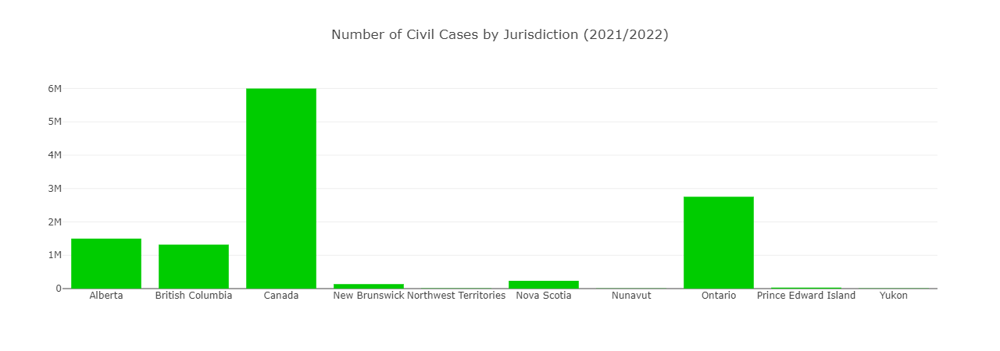
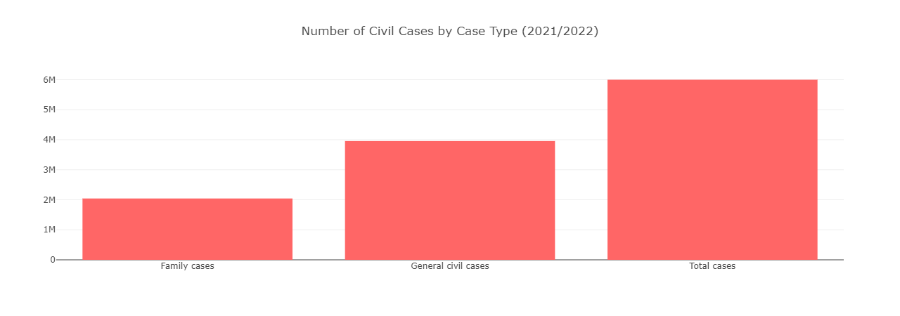
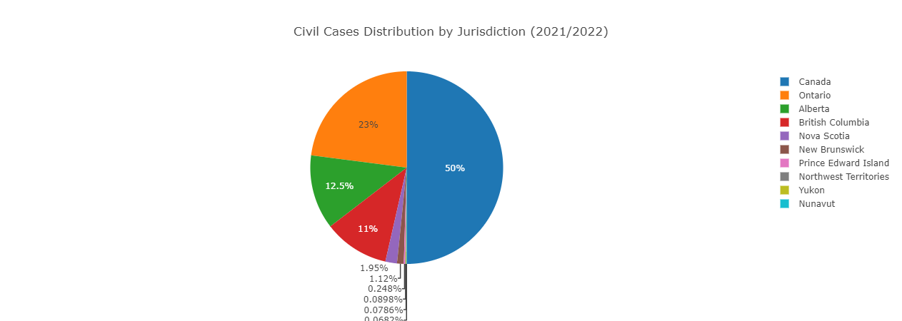
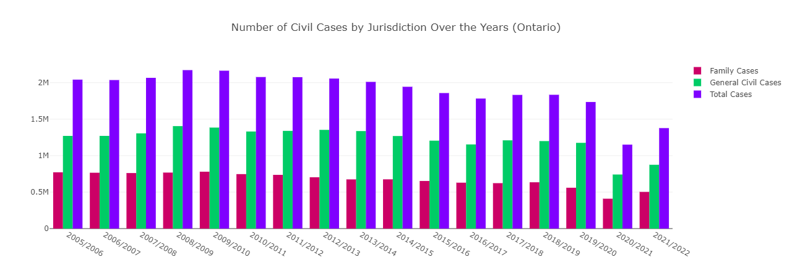
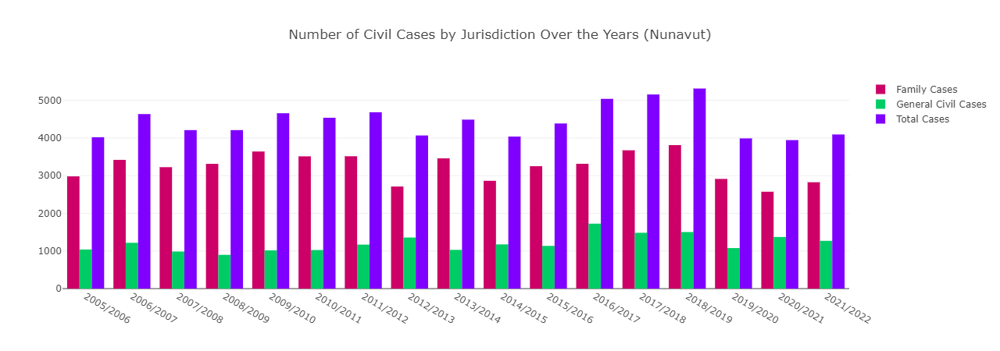
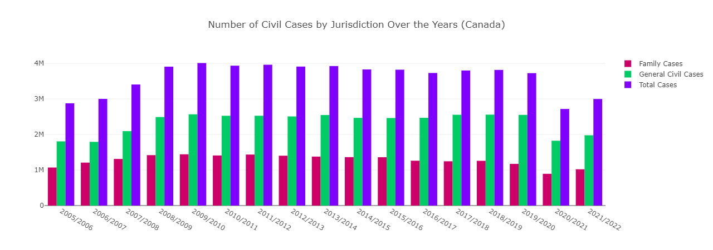

# Project Three: Canadian and Certain Jurisdictions Civil Court Cases by Level of Court and Type of Case from 2005 to 2022

## Introduction

This project aims to visualize the civil court cases that have been initiated in Canada and certain jurisdictions using the data gathered by the govenrment of Canada between the years 2005 to 2022. The purpose of the project is to compare the provincial and federal civil court cases through the years and compare jurisdictions. 

Civil court case is initiated when individuals or corporations disagree on a legal matter. A civil case may also arise if someone is injured or there is damage to property. Family law also includes a substanital amount of civil cases which may include divorce, seperation child custody, access and support, and other family issues. 

The questions this projects is attempting to explore and visualize are: 

1. Is there a certain jurisdiction that has more civil court cases? 1. Ontario 2. Alberta 3. BC
2. What type of civil court cases (family or general civil) are more frequent in all jurisdictions? In all the jurisdictions except for Nunavut, there are more general civil cases.
3. Has there been a significant growth pattern acorss different jurisdictions in the number of cases? The opposite is in fact correct. There was a growth trajectrory in almost all the jurisdcitions however in the last couple of years the numbers have gone down significantly. 

## Methodology

### ETL 

The data was published by Statistic Canada in CSV format. I used Jupyter Notebook to clean up the data and imported into a postgres SQL server using pgAdmin. 

### Flask

I used SQLAlchemy to create the an API that holds the data from the SQL server. Then in order to query parameters I used the following code to filter the results. 

Code snippet: 

    @app.route("/api/v1.0/civil_court_data")
    def civil_court_data():
    session = Session(engine)

    # Get query parameters
    year = request.args.get('year')
    place = request.args.get('place')

    # Filter data based on query parameters
    query = session.query(Civil)
    if year:
        query = query.filter_by(Year_Period=year)
    if place:
        query = query.filter_by(Jurisdiction=place)
    
    results = query.all()
 
### HTML 

I created three HTML files: an index HTML file for the main route, and two HTML files, one for each remaining route. 

#### index.html 

I used Bootstrap for styling and creating the navigation bar on the index page.

Code snippet: 

    <header class="bg-dark text-light py-4">
        

            <h1>Welcome to Civil Case Data Main Page!</h1>
        

    </header>

    <nav class="bg-light py-3 d-flex justify-content-center">
        <ul class="nav">
            <li class="nav-item"><a class="nav-link" href="/api/v1.0/civil_court_data">Civil Court Data API</a></li>
            <li class="nav-item"><a class="nav-link" href="/jurisdiction_chart">Jurisdiction Data</a></li>
            <li class="nav-item"><a class="nav-link" href="/full_chart">Full Data</a></li>
        </ul>
    </nav>
    

### JavaScript

There are two seperate routes created to visualize the data. The first uese to group the data by year and visualize each juridiction and case type per year. 

#### Full data by year

To achive this at first d3.json function is used to fetch the data from the API. Then the dropdown element with id of "yearSelect" is used.  Next, an array of unique years by mapping over the fetched data (data) and extracting the 'Year_Period' property of each entry is created. The Set object ensures uniqueness, and Array.from converts the set back to an array. Next, the options for the drop down created. It iterates over each unique year in the years array. For each year, it creates an <option> element, sets its value attribute to the year value, sets its textContent to the year value, and appends it to the dropdown list. It also sets the firstYear variable to the first year in the array. Later the event listener is added to retrieve the value of each year from the dropdown and a function is called to pass each selected year's value. Lastly the first year's data is fetched to display when the page loads. 

Code snippet: 

// Fetch data and populate dropdown
d3.json(url).then(data => {
    console.log('Data fetched:', data); // Log fetched data
    var yearSelect = document.getElementById('yearSelect');
    var years = Array.from(new Set(data.map(entry => entry.Year_Period))); // Get unique years
    console.log('Unique years:', years); // Log unique years
    var firstYear = "";
    years.forEach(year => {
        var option = document.createElement('option');
        option.value = year;
        if (firstYear.length < 1)
            {firstYear = year;}
        option.textContent = year;
        yearSelect.appendChild(option);
    });
    // Attach event listener to dropdown
    yearSelect.addEventListener('change', function() {
        var selectedYear = this.value;
        console.log('Selected year:', selectedYear); // Log selected year
        // Call function to fetch data for selected year
        fetchDataForYear(selectedYear);
    });
    fetchDataForYear(firstYear);
})

The next step a function is created to fetch the data from the API for each year to prapare to generate the charts. The last function is to generate the charts using plotly. For the full data visualization, a bar chart of all the jurisdictions, a bar chart of all the case types and a pie chart of the jurisdictions per year period are created. 

#### Full data by jurisdiction

The creation of the dropdown and the functions to fetch the data for each jurisdiction is the same as the one by year. The only difference between the two is the variable "year" is replaced by the variable "place". 

For the jurisdiction visualization a bar chart is created to show each jurisdictions cases (by case type) through teh available years. 

## Analysis

#### Analysis of the Data by Year

Analyzing the the data aby year, it shows that not all jurisidictions have available data. The data shows that other than jurisdiction of Canada (unclear if federal data or aggergate of provinces), the top three provinces are Ontario then followed by alberta and British Columbia respectively. Visulaizations of the data for the year period 2021/2022 are shown below: 

Data by jurisdcition for 2021/2022 (bar chart):

Data by case type for 2021/2022 (bar chart):

Data by jurisdcition for 2021/2022 (pie chart):

#### Analysis of the Data by Jurisdiction

The jurisdiction visualization gives us more details to each available jurisdictions cases. In almosy all jurisdictions, the number if general civil cases are higher than family civil cases. The only exception is Nunavut which has a higher rate of family civil cases than general civil cases. The margin of difference between the two case types are varied in each jurisdiction. 

Visualization of Ontario, Nunavut and Canada are shown below: 

Ontario: 

Nunavut:

Canada:

The data also shows that in every jurisdiction, there are less number of cases in the last two year periods of teh available data (2020 to 2022). This suggests that the pandemic years affected the number of civil cases initiated in all jurisdictions. 

## Limitations

One of the biggest limitations of this data analysis is the lack of data for all jurisdictions in Canada. There are no data for Manitoba, Newfoundland and Labrador and Quebec. The lack of data for Quebect is understandable as Quebec has its own unique judicial system.  

Another limitation on this data is the fact that the data does not provide further details on the jurisdiction of Canada. It does not clarify if the data is for the federal court system civil cases (Federal Court, Federal Court of Appeal, Tax Court), or is the data actually an aggregate of all the provinces.

The data also does not provide us with the level of court in each case type. This has the potential of misrepresenting the data as a case that has been initiated at a superior court has the potential to go to another level of court (appeal, bankruptcy, commercial list, etc.). However the data does not specify how it has been collected to account for these type of cases. 

## Data and Resources

The data was retrieved from government of Canada's open database. 

### Dataset

- Civil court cases, by level of court and type of case, Canada and selected provinces and territories - Dataset (https://open.canada.ca/data/en/dataset/5641ad22-190a-4486-8c5d-3884328a51a5/resource/108a7554-fe40-4fba-951a-d06debb76bca)

### Resources

- Govenrment of Canada website for overview of the judicial system (https://www.justice.gc.ca/eng/csj-sjc/just/08.html)
- Wikipedia article for Court System of Canada (https://en.wikipedia.org/wiki/Court_system_of_Canada)

## Project Member

This is a solo project by: 

- Behnoosh Nasri 